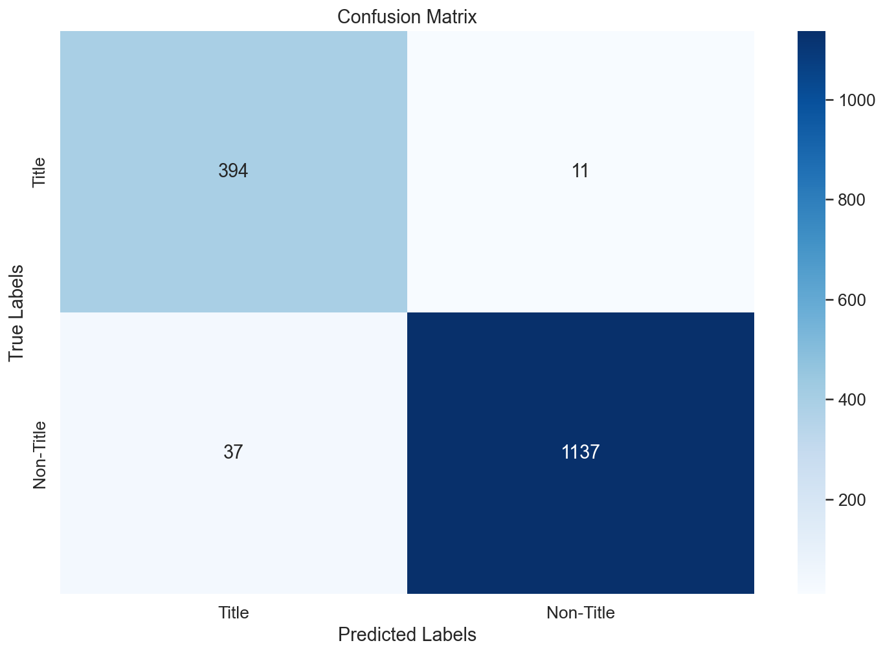

### Introduction:

I fine-tuned a Bert model in this project and concatenated the output from the Bert model with the other features together to do title detection. 

## Installation
- Clone this repo:
```bash
git clone https://github.com/XianmingJin08/Title-Detection.git
cd Title-Detection
```
- Install python requirements:
```bash
pip install -r requirements.txt
```

## Dataset
The dataset used is the provided dataset which is in the data/raw folder. I have preprocessed the data and stored them in the data/preprocessed using a script called preprocessing_dataset in the src/features. You can call it by:
```bash
python ./src/features/preprocessing_dataset.py
```
Overall, I firstly resolve an encoding issue when loading the dataset using pandas.read_csv function. Then, I removed the feature "FontType" as I found it is the same across all the datasets, which is redundant in this case. I then changed the Boolean values of features such as IsBold to 0s and 1s to be easier to feed to the classifier. Lastly, I transformed the location variables to zero means and unit variance, making the classifier's performance more stable. 

### 1) Training
There are two types of models you could train in this case: the simple Bert model or the BertSequenceClassifier model, which was pre-train on sequence classification tasks. Note an evaluation is done automatically after training.

For Bert model:
```bash
python main.py --path=[the folder you want to store or load your model] --training
```
For BertSequence model:
```bash
python main.py --bertSequence --path=[the folder you want to store or load your model] --training
```

### 2) Testing
I have trained two models and uploaded them onto google driver. You could download both models by running:
```bash
bash ./scripts/download_model.sh
```
This would create two folders: Bert and bertSequence, and download the models into the folders.
Similarly, you could define whether you want to predict using Bert or BertSequence by --bertSequence flat. One example using Bert would be:

```bash
python main.py --path=/models/bert 
```

The result is shown below:
```
Classification Report:
AUROC:  0.9706616610932342
              precision    recall  f1-score   support

           1     0.9142    0.9728    0.9426       405
           0     0.9904    0.9685    0.9793      1174

    accuracy                         0.9696      1579
   macro avg     0.9523    0.9707    0.9610      1579
weighted avg     0.9709    0.9696    0.9699      1579

Random 5 wrong sentences examples: [(text,other_features,true_label)]
 [[('Andrew Keith Craddock', [0.0, 0.0, 0.0, -0.331781268119812, -1.089382529258728, -1.031014084815979, -1.1383377313613892], 1.0)],
 [('Carrying amount', [1.0, 0.0, 0.0, 0.4512971043586731, -1.0393980741500854, -0.35968726873397827, -0.4746514856815338], 0.0)],
 [('Strategic Report for the year ended 31 December 2016 (continued)', [1.0, 0.0, 0.0, -0.3585990369319916, -0.047484494745731354, -0.8929795026779175, -0.9942114949226379], 1.0),
 ('(c)', [0.0, 0.0, 0.0, -0.3585990369319916, -1.4422357082366943, -0.6734485030174255, -0.7881008982658386], 0.0),
 ('Financial Statement Schedule.', [0.0, 0.0, 0.0, 1.144982933998108, -0.817615270614624, 0.8841518759727478, 0.7393350005149841], 0.0)],
 [('Our acquisitions may expose us to significant unanticipated liabilities and could adversely affect our business, financial condition and results of operations.',
 [0.0, 1.0, 0.0, -0.4211737811565399, 0.3938596844673157, 0.3090927302837372, 0.17089299857616425], 0.0)],
 [("Successfully competing in the highly competitive tire industry can be impacted by the successful development of information technology. If the Company fails to successfully develop or implement information technology systems, it may be at a disadvantage to its competitors resulting in lost sales and negative impacts on the Company's earnings.",
 [0.0, 0.0, 0.0, -0.6786242127418518, 1.3083899021148682, -0.6418686509132385, -0.7246047258377075], 0.0)]]

```



  
